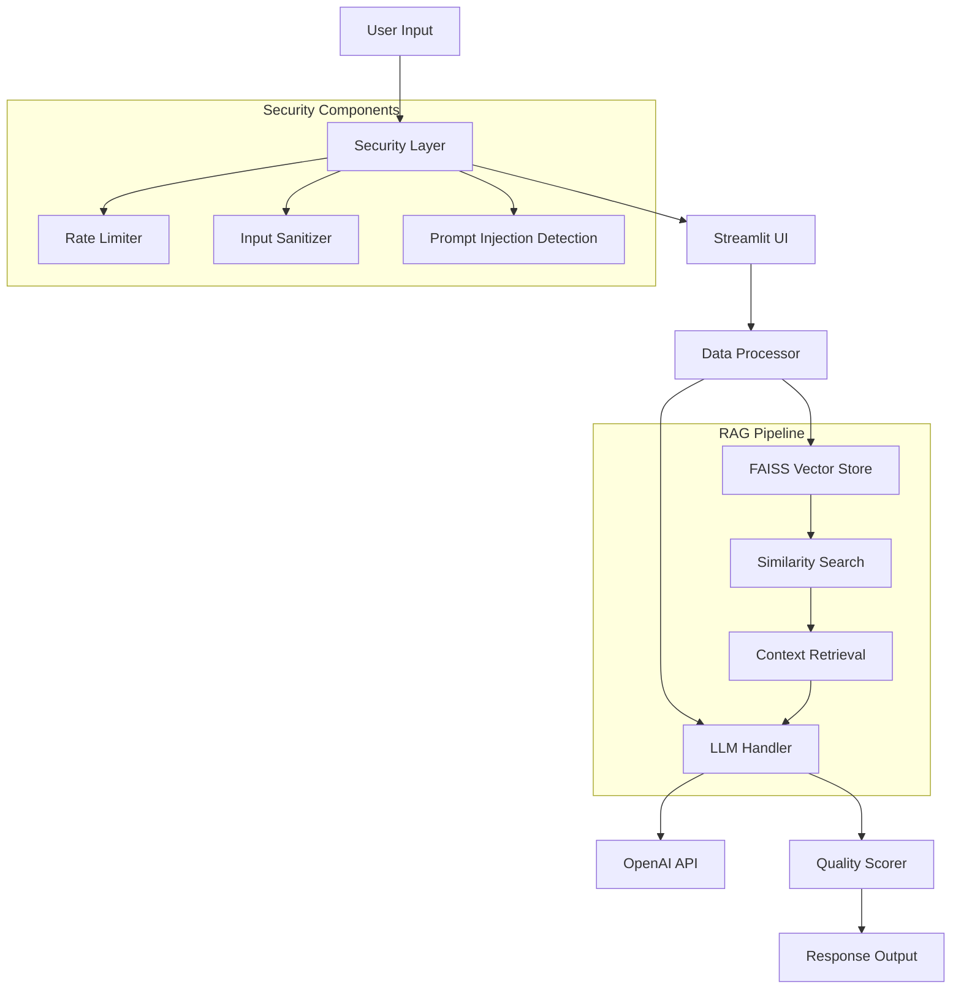

# 🤖 Nawatech FAQ Chatbot

A sophisticated AI-powered FAQ chatbot built with **Streamlit**, **LangChain**, and **OpenAI GPT** featuring **RAG (Retrieval-Augmented Generation)** for accurate and contextual responses about Nawatech services and products.

[](https://www.python.org/downloads/)
[](https://streamlit.io/)
[](https://langchain.com/)
[](https://www.docker.com/)
[](https://kubernetes.io/)

## 📋 Table of Contents

- [🌟 Features](#-features)
- [🏗️ Architecture](#️-architecture)
- [🚀 Quick Start](#-quick-start)
- [📁 Project Structure](#-project-structure)
- [⚙️ Configuration](#️-configuration)
- [🐳 Docker Deployment](#-docker-deployment)
- [☸️ Kubernetes Deployment](#️-kubernetes-deployment)
- [🔒 Security Features](#-security-features)
- [📊 Quality Scoring](#-quality-scoring)
- [🧪 Testing](#-testing)
- [📈 Monitoring](#-monitoring)

## 🌟 Features

### 🎯 Core Features
- **RAG Implementation**: Advanced retrieval-augmented generation using FAISS vector database
- **Multi-Model Support**: Compatible with OpenAI GPT-3.5/GPT-4 and other LangChain-supported models
- **Interactive UI**: Clean, responsive Streamlit interface with real-time chat
- **Quality Scoring**: Comprehensive response quality evaluation with multiple metrics
- **Conversation Memory**: Context-aware conversations with configurable memory window

### 🛡️ Security Features
- **Rate Limiting**: Configurable request limits per user/minute/hour
- **Input Sanitization**: Protection against XSS, SQL injection, and prompt injection
- **API Key Security**: Secure handling of sensitive credentials
- **Session Management**: Stateless session handling with security best practices
- **Network Policies**: Kubernetes network policies for container security

### 🚀 Production Features
- **Docker Ready**: Complete containerization with multi-stage builds
- **Kubernetes Support**: Production-ready K8s manifests with scaling and monitoring
- **Health Checks**: Comprehensive liveness and readiness probes
- **Logging**: Structured logging with configurable levels
- **Monitoring**: Built-in metrics and health monitoring endpoints

## 🏗️ Architecture



### Component Overview

- **Data Processor**: Handles FAQ data loading, preprocessing, and vector embeddings
- **LLM Handler**: Manages OpenAI integration and RAG implementation
- **Security Manager**: Implements rate limiting, input validation, and attack prevention
- **Quality Scorer**: Evaluates response quality using multiple metrics
- **Vector Store**: FAISS-based similarity search for document retrieval

## 🚀 Quick Start

### Prerequisites

- Python 3.9 or higher
- OpenAI API key ([Get free tier](https://platform.openai.com/api-keys))
- Docker (optional, for containerization)
- Kubernetes cluster (optional, for K8s deployment)

### Local Development Setup

1. **Clone the repository**
   ```bash
   git clone https://github.com/your-username/nawatech-faq-chatbot.git
   cd nawatech-faq-chatbot
   ```

2. **Create virtual environment**
   ```bash
   python -m venv venv
   
   # On Windows
   venv\Scripts\activate
   
   # On macOS/Linux
   source venv/bin/activate
   ```

3. **Install dependencies**
   ```bash
   pip install -r requirements.txt
   ```

4. **Set up environment variables**
   ```bash
   cp .env.example .env
   # Edit .env file and add your OpenAI API key
   ```

5. **Prepare data directory**
   ```bash
   mkdir -p data
   # Place your FAQ_Nawa.xlsx file in the data directory
   ```

6. **Run the application**
   ```bash
   streamlit run app.py
   ```

7. **Access the chatbot**
   Open your browser and navigate to `http://localhost:8501`

## 📁 Project Structure

```
nawatech-faq-chatbot/
├── 📄 app.py                      # Main Streamlit application
├── 📁 chatbot/                    # Core chatbot modules
│   ├── 📄 __init__.py
│   ├── 📄 data_processor.py       # Data processing and embeddings
│   ├── 📄 llm_handler.py          # LLM integration and RAG
│   ├── 📄 security.py             # Security and rate limiting
│   └── 📄 quality_scorer.py       # Response quality evaluation
├── 📁 config/                     # Configuration management
│   ├── 📄 __init__.py
│   └── 📄 settings.py             # Application settings
├── 📁 data/                       # Data files and vector store
│   └── 📄 FAQ_Nawa.xlsx          # FAQ data (your file here)
├── 📁 k8s/                        # Kubernetes manifests
│   ├── 📄 deployment.yaml         # Application deployment
│   ├── 📄 service.yaml           # Service definitions
│   ├── 📄 configmap.yaml         # Configuration maps
│   └── 📄 secret.yaml            # Secrets (template)
├── 📄 requirements.txt            # Python dependencies
├── 📄 Dockerfile                  # Docker configuration
├── 📄 docker-compose.yml          # Docker Compose setup
├── 📄 .env.example               # Environment variables template
├── 📄 .dockerignore              # Docker ignore patterns
├── 📄 .gitignore                 # Git ignore patterns
└── 📄 README.md                  # This file
```

## ⚙️ Configuration

### Environment Variables

Key configuration options available in `.env`:

| Variable | Description | Default | Required |
|----------|-------------|---------|----------|
| `OPENAI_API_KEY` | OpenAI API key | - | ✅ |
| `OPENAI_MODEL` | GPT model to use | `gpt-3.5-turbo` | ❌ |
| `TEMPERATURE` | Response creativity (0.0-2.0) | `0.7` | ❌ |
| `CHUNK_SIZE` | Document chunk size | `1000` | ❌ |
| `RETRIEVAL_K` | Number of documents to retrieve | `4` | ❌ |
| `RATE_LIMIT_PER_MINUTE` | Request limit per minute | `10` | ❌ |

### Model Configuration

The chatbot supports various OpenAI models:

- **gpt-3.5-turbo** (recommended for cost-efficiency)
- **gpt-4** (better quality, higher cost)
- **gpt-3.5-turbo-16k** (for longer contexts)

### RAG Configuration

Fine-tune retrieval performance:

```python
CHUNK_SIZE = 1000          # Size of document chunks
CHUNK_OVERLAP = 200        # Overlap between chunks
RETRIEVAL_K = 4            # Number of documents to retrieve
SIMILARITY_THRESHOLD = 0.7 # Minimum similarity score
```

## 🐳 Docker Deployment

### Using Docker Compose (Recommended)

1. **Set up environment**
   ```bash
   cp .env.example .env
   # Edit .env with your configuration
   ```

2. **Build and run**
   ```bash
   docker-compose up --build
   ```

3. **Access the application**
   Navigate to `http://localhost:8501`

### Using Docker directly

```bash
# Build the image
docker build -t nawatech-chatbot .

# Run the container
docker run -p 8501:8501 \
  -e OPENAI_API_KEY=your-api-key \
  -v $(pwd)/data:/app/data:ro \
  nawatech-chatbot
```

### Production Docker Setup

For production deployment with additional services:

```bash
# Start with Redis and Nginx
docker-compose --profile with-redis --profile with-nginx up -d
```

## ☸️ Kubernetes Deployment

### Prerequisites

- Kubernetes cluster (1.19+)
- kubectl configured
- Ingress controller (for external access)

### Deployment Steps

1. **Create namespace (optional)**
   ```bash
   kubectl create namespace nawatech
   ```

2. **Set up secrets**
   ```bash
   # Create OpenAI API key secret
   kubectl create secret generic nawatech-secrets \
     --from-literal=openai-api-key=your-openai-api-key \
     --namespace=nawatech
   ```

3. **Deploy the application**
   ```bash
   kubectl apply -f k8s/ --namespace=nawatech
   ```

4. **Verify deployment**
   ```bash
   kubectl get pods -n nawatech
   kubectl get services -n nawatech
   ```

5. **Access the application**
   ```bash
   # Port forward for testing
   kubectl port-forward service/nawatech-chatbot-service 8501:80 -n nawatech
   
   # Or access via Ingress (if configured)
   # https://chatbot.yourdomain.com
   ```

### Scaling

```bash
# Scale deployment
kubectl scale deployment nawatech-chatbot --replicas=5 -n nawatech

# Auto-scaling
kubectl autoscale deployment nawatech-chatbot \
  --cpu-percent=70 --min=2 --max=10 -n nawatech
```

## 🔒 Security Features

### Input Validation & Sanitization

- **XSS Protection**: HTML escaping and input sanitization
- **SQL Injection Prevention**: Input validation and parameterized queries
- **Prompt Injection Detection**: Advanced pattern matching for prompt injection attempts

### Rate Limiting

- **Per-user limits**: Configurable requests per minute/hour
- **Global limits**: System-wide rate limiting
- **Graceful degradation**: Informative error messages

### API Security

- **Key Management**: Secure handling of API keys using environment variables
- **Request Validation**: Input length limits and format validation
- **Error Handling**: Secure error messages without information leakage

### Network Security

- **Container Security**: Non-root user, read-only filesystem
- **Network Policies**: Kubernetes network policies for traffic control
- **TLS/SSL**: HTTPS encryption for production deployments

## 📊 Quality Scoring

The chatbot includes a comprehensive quality scoring system that evaluates responses across multiple dimensions:

### Scoring Components

1. **Relevance Score (30%)**
   - Query-response semantic similarity
   - Keyword overlap analysis
   - Context utilization

2. **Completeness Score (25%)**
   - Response length optimization
   - Information coverage
   - Structural completeness

3. **Accuracy Score (25%)**
   - Factual consistency with sources
   - Hallucination detection
   - Source validation

4. **Clarity Score (20%)**
   - Readability metrics
   - Grammar and structure
   - Professional tone

### Quality Metrics

- **Overall Score**: 0.0 - 10.0 scale
- **Component Scores**: Individual dimension scoring
- **Confidence Level**: Model certainty indicator
- **User Feedback**: Optional rating system

## 🧪 Testing

### Running Tests

```bash
# Install test dependencies
pip install pytest pytest-asyncio

# Run all tests
pytest

# Run with coverage
pytest --cov=chatbot

# Run specific test categories
pytest tests/unit/
pytest tests/integration/
```

### Test Categories

- **Unit Tests**: Individual component testing
- **Integration Tests**: End-to-end workflow testing
- **Security Tests**: Vulnerability and attack testing
- **Performance Tests**: Load and stress testing

### Test Data

Sample test files are provided in `tests/data/` for consistent testing across environments.

## 📈 Monitoring

### Health Checks

- **Liveness Probe**: Application health status
- **Readiness Probe**: Service availability
- **Custom Health Endpoint**: `/health` endpoint for monitoring

### Metrics

- **Response Times**: Average and percentile response times
- **Error Rates**: Error frequency and types
- **Usage Statistics**: User interaction patterns
- **Quality Metrics**: Average response quality scores

### Logging

Structured logging with multiple levels:

```python
# Log levels: DEBUG, INFO, WARNING, ERROR, CRITICAL
# Configurable via LOG_LEVEL environment variable
```

### Production Monitoring

For production deployments, consider integrating:

- **Prometheus**: Metrics collection
- **Grafana**: Metrics visualization
- **ELK Stack**: Log aggregation and analysis
- **Sentry**: Error tracking and alerting